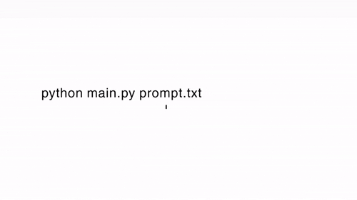

# Text to Video Generator

A small Python system that converts text (or code / data) into narrated videos using ElevenLabs text-to-speech and MoviePy-based visual rendering.

Built to practice end-to-end execution: prompt → audio → video → artifact.





---

## What the System Does

### 🎙️ Audio Generation

Uses ElevenLabs text-to-speech to convert narration into `.mp3` audio.

* API key loaded from `.env`
* One client per execution
* Audio duration drives video length

### 🎬 Video Rendering

All videos are generated frame-by-frame using MoviePy + PIL.

**Supported visualisers:**

* 📝 **Text Video** (`main.py`)         
    * Plain background
    * Typewriter-style text animation
    * Narrated speech synced to text
* 💻 **Code Visualizer** (`code_visualiser.py`)
    * Line-by-line code reveal
    * Syntax-aware coloring
    * Carbon-style window layout
    * Typewriter and/or static reveal
* 📊 **Graph Visualizer** (`graph_visualiser.py`)
    * Animated bar charts
    * Animated line graphs
    * Narrated explanations

---

## Project Structure
```bash
text-to-video/
├── main.py                   # Text → narrated video (Renamed)
├── code_visualiser.py        # Code → narrated code video
├── graph_visualiser.py       # Data → animated charts
├── config.py                 # Central configuration & env loading
├── requirements.txt
├── static/                   # Static assets for HTML previews
│   └── master.css            # Terminal styling for code visualizer
├── outputs/                  # Generated videos & audio (ignored by git)
├── .env                      # API keys (ignored by git)
└── .gitignore
```

## Setup

### Requirements

* Python 3.9+
* FFmpeg available on system PATH
* ElevenLabs API key
* Playwright (for code visualization)

### Installation

```bash
git clone https://github.com/Yaandle/text-to-video.git
cd text-to-video
python -m venv ttv_venv
ttv_venv\Scripts\activate
pip install -r requirements.txt
playwright install chromium
```

### Environment Variables
Create a .env file:
```bash
ELEVENLABS_API_KEY=sk-...
```

## Usage

### Text -> Video

You can edit prompt.txt (or create your own file) and pass it to the program:

```bash
python main.py prompt.txt
```


**Marker syntax:**

### Code Visualisation
Basic usage (uses startup-selected animation mode):
```bash
[VisualiseCode]
def hello():
    print("Hi")
[/VisualiseCode]
```

Override animation mode per block:
```bash
[VisualiseCode:1]        → typewriter animation
[VisualiseCode:0]        → static reveal
[VisualiseCode:typewriter]
[VisualiseCode:static]
```

### Graph Visualisation

Format:
```bash
[VisualiseGraph:type|theme]label:value,label:value[/VisualiseGraph]
```
```bash 
[VisualiseGraph:bar|dark]Python:85,JavaScript:72[/VisualiseGraph]
[VisualiseGraph:line|matrix]Jan:10,Feb:20,Mar:15[/VisualiseGraph]
```
***Graph Types***
- bar
- line

### Themes
- heaven (light)
- dark
- matrix


## Execution Framework (Fibonacci Ladder)

This project follows a Fibonacci Ladder execution model.

Each stage prioritises completion and correctness over features.

### Stage 1 — Foundational Win ✅

Goal: Finish something real, small, and runnable.

* Single language (Python)
* Local execution only
* Real input → real output
* No deployment concerns

**Outcome:**
`video_generator.py` generates:
* narrated audio (.mp3)
* a rendered video (.mp4)
* Secrets handled via `.env`
* Output artifacts written to disk

### Stage 2 — Structured Variations ✅

Goal: Reuse the same pipeline with controlled variation.

Built multiple generators on the same foundation:

1.  Text narration → video
2.  Code → narrated code visualization
3.  Data → narrated graph animation

**All variants:**
* Share config
* Share audio generation logic
* Differ only in visual rendering

### Stage 3 — System Formation 🧩 (in progress)

Goal: Turn scripts into a small, coherent system.

**Characteristics present:**
* Single `config.py` as source of truth
* Clear separation:
    * configuration
    * audio generation
    * rendering
* No hard-coded secrets
* Minimal duplication

**Not claimed yet:**
* Production hardening
* API stability
* Performance optimisation


---
New code_visualise.py

